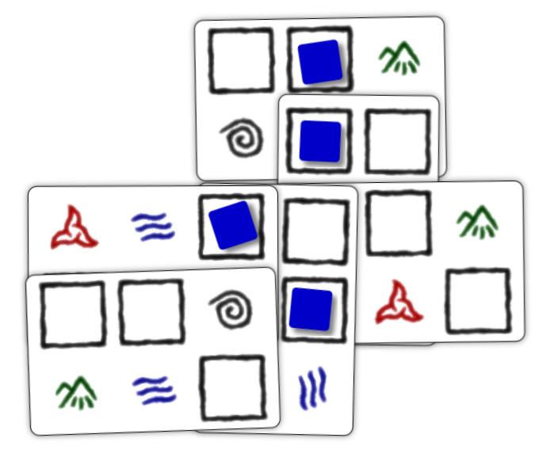

# Blockchain

A tabletop game where fragile wizards chain together blocks of micro-code spell fragments.

```
* This game is a Work In Progress and is still in the early playtesting phase. *
```



* [Rules](docs/rules.md)
   * [Placing Matrix Cards](docs/placing-matrix-cards.md)
	* [Casting Spells](docs/casting-spells.md)
	* [Targeting](docs/targeting.md)

_(Note: The name "blockchain" is a placeholder until
I come up with a real one.)_
