# Woven

## Woven is a tabletop game of tactical wizard combat

### Cast spells by making patterns found on Spell Cards

<a href="img/readme/spell1.png">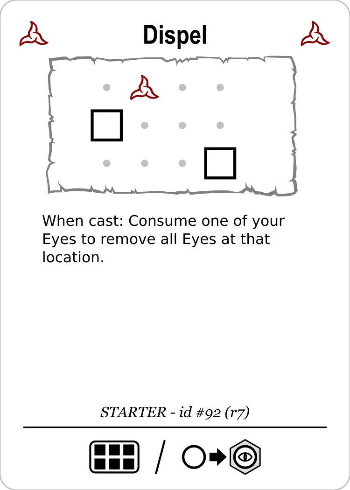</a>
&nbsp; &nbsp;
<a href="img/readme/spell2.png">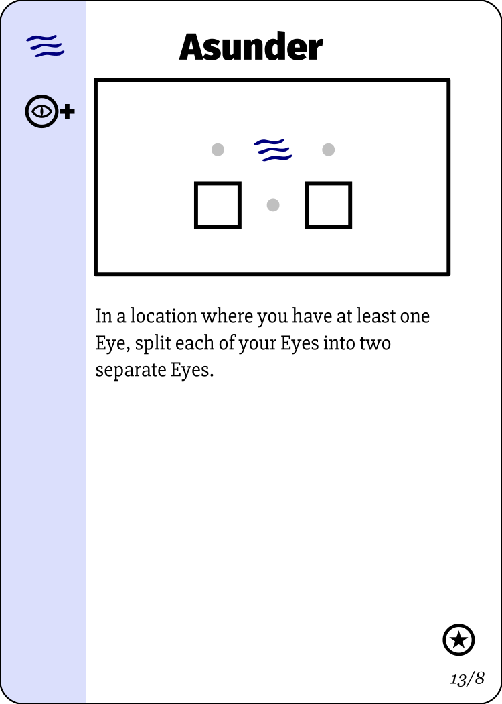</a>

### Create these patterns in your Tapestry

<a href="img/readme/tapestry.png">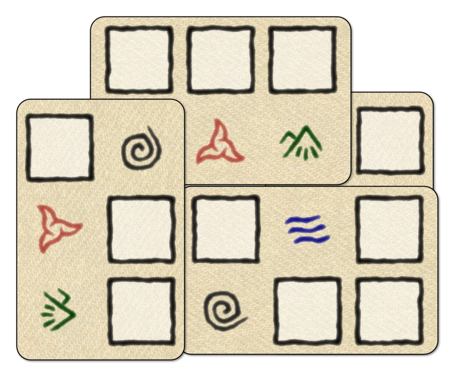</a>

### Finish the spellcast by adding mana Threads that complete the pattern

&nbsp; &nbsp;
<a href="img/readme/tapestry-mana1.png">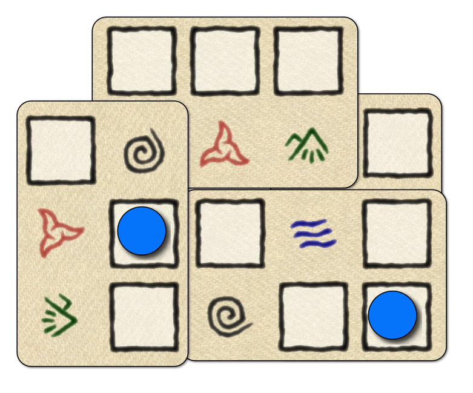</a>

### These spell patterns may be mirrored, flipped or rotated

&nbsp; &nbsp;
<a href="img/readme/tapestry-mana2.png">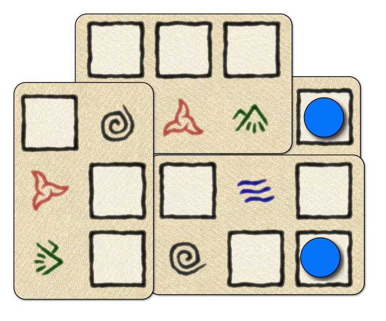</a>

### Threads may be reused for multiple spells, and spells may be cast multiple times

&nbsp; x2 &nbsp;

&nbsp; &nbsp;
<a href="img/readme/tapestry-mana3.png">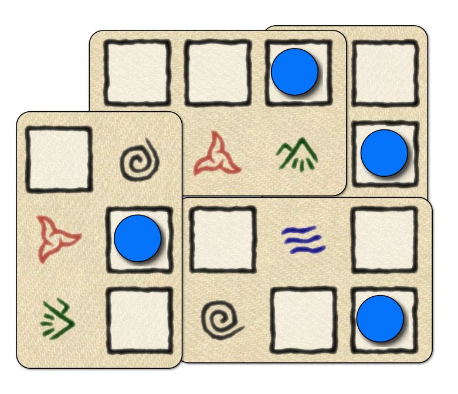</a>

### Woven is played on a [Map](map/index.md)

### You are on the map, but you are weak and fragile

<a href="img/readme/map-player.png">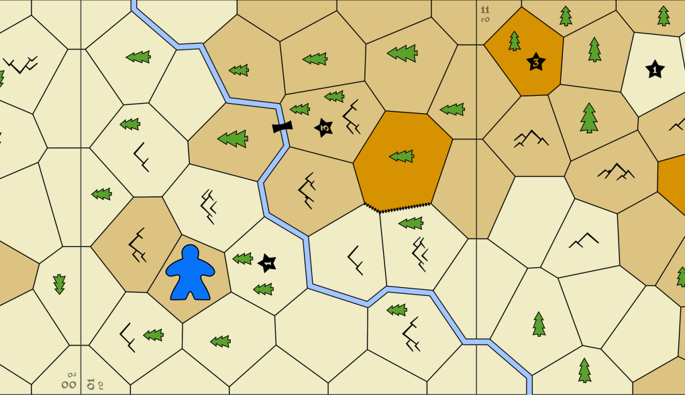</a>

### But you can cast spells using your mana

<a href="img/readme/spell3.png">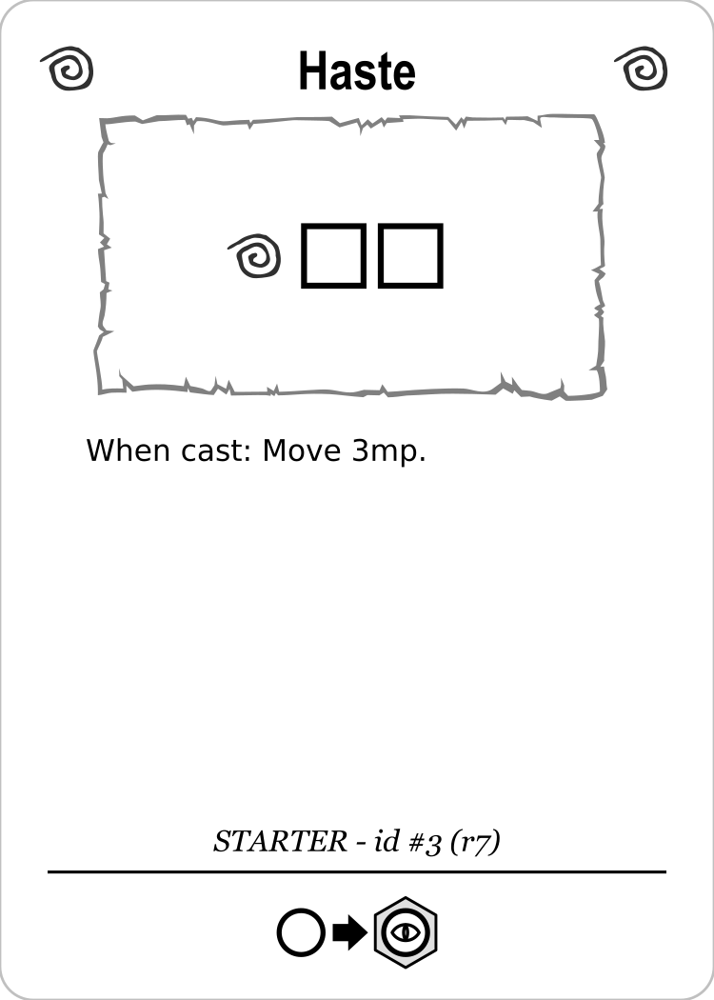</a>
&nbsp; &nbsp;
<a href="img/readme/spell5.png">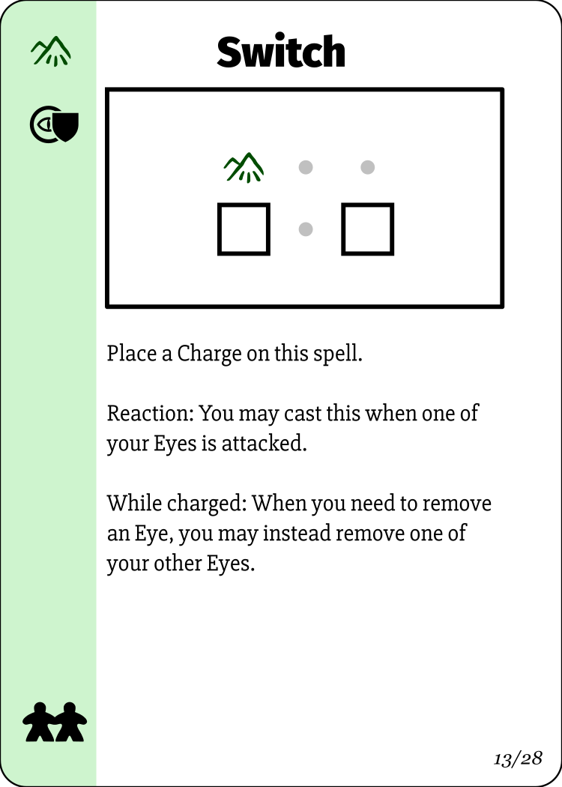</a>
&nbsp; &nbsp;

### And move mana Eyes around the map to exert influence

<a href="img/readme/map-player-mana.png">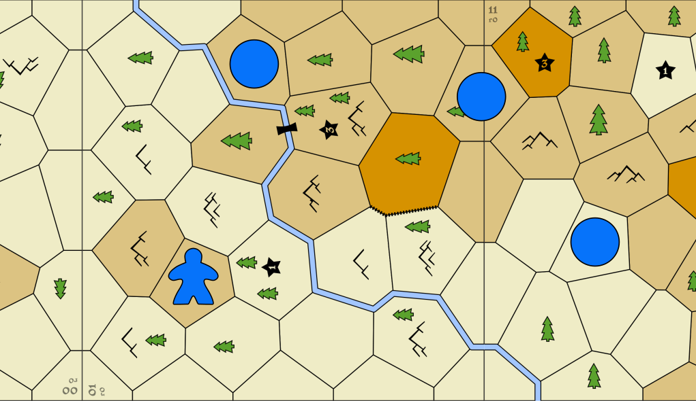</a>

### Or trigger effects in that location

<a href="img/readme/spell4.png">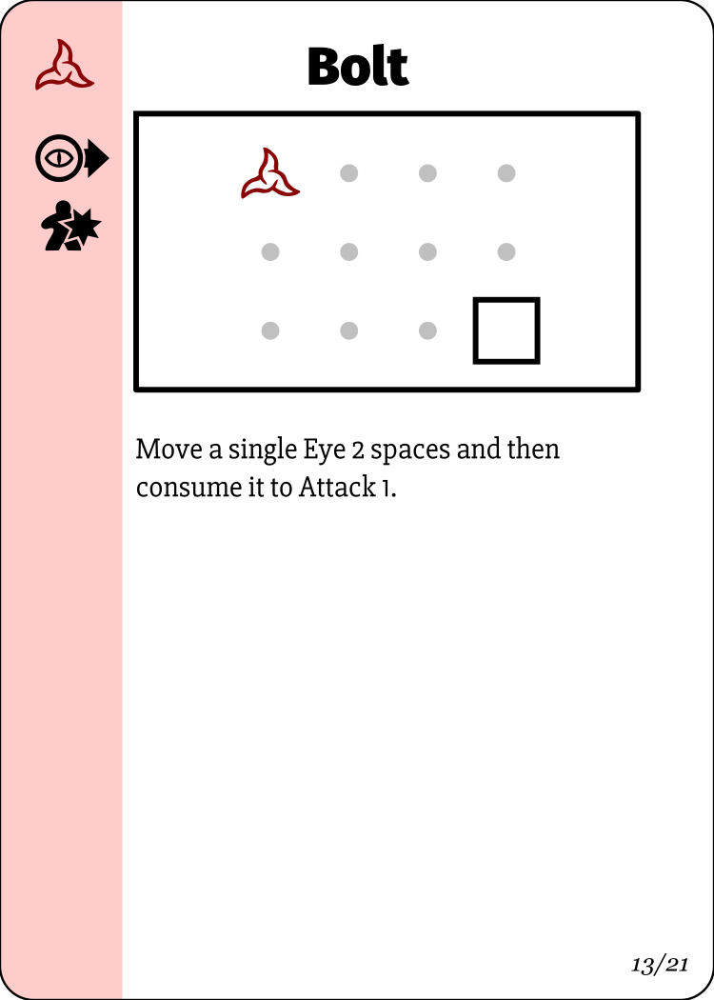

### But your mana is limited, and you must balance your need for Threads and Eyes

<a href="img/readme/player-mana.png">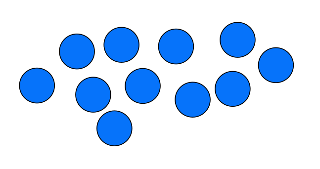

### Each spell card also has a set of alternate actions

<a href="img/readme/actions.png">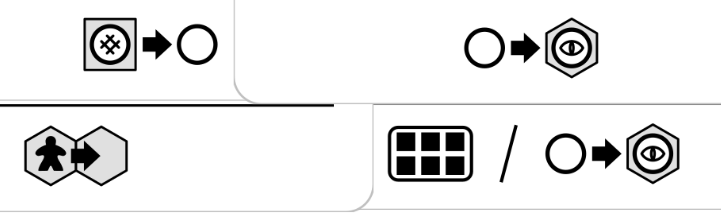

### These actions allow you to move your frail body on the map...

<a href="img/readme/action-move.png">

### ...or place a new Eye on the map

<a href="img/readme/action-eye.png">

### ...or recover a Thread back into your mana pool

<a href="img/readme/action-thread.png">

### ...or add a new card to your Tapestry

<a href="img/readme/action-tapestry.png">

