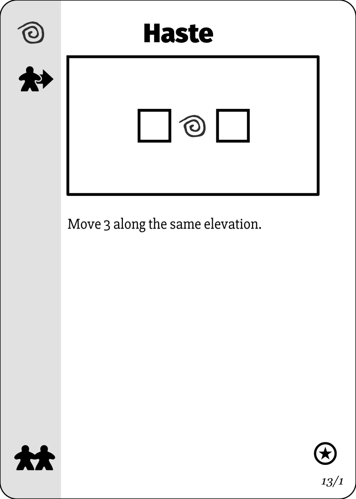

# Woven

## Woven is a tabletop game of tactical magecraft

### Prepare spells by making patterns found in your Spell Book

&nbsp; &nbsp;

### Create these patterns in your [Tapestry](docs/tapestry-card-placement.md)

### Complete the spellcast by adding mana Threads that complete the pattern

&nbsp; &nbsp;

### These spell patterns may be mirrored, flipped or rotated

&nbsp; &nbsp;

### Threads may be reused for multiple spells, and spells may be cast multiple times

&nbsp; x2 &nbsp;

&nbsp; &nbsp;

### Woven is played on a map

### You are on the map, but you are weak and fragile

### But you can cast spells using your mana

&nbsp; &nbsp;

&nbsp; &nbsp;

### And move mana Eyes around the map to exert influence

### Or trigger effects in that location

### But your mana is limited, and you must balance your need for Threads (to cast spells) and Eyes (for influence on the map)

