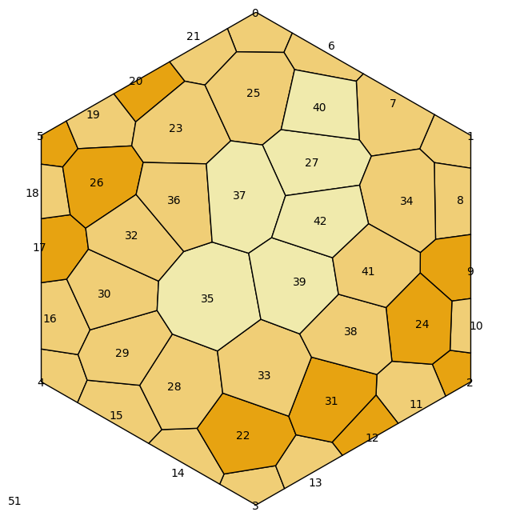

# Creating Map Tiles

## Voronoi cleanup

Before and after region cleanup:

 

In particular, note the following ridges which are too short:

Here is an animation of region cleanup process.
The red dots identify ridges that are too short (eg: between 17 and 26), or regions with seeds that are too close (eg: 8 and 34 starting at frame 14). When problems are identified, the seeds are adjusted and then the voronoi graph is regenerated.

Enforcing this minimum ridge length is important so that players can easily determine whether 2 regions are adjacent or not.

## Minimum region size

In addition to ensuring that the ridges are not too short, 

## Relaxation

Whenever a localized adjustment needs to be made, a very small global relaxation is also applied to the entire voronoi graph using [Lloyd's Relaxation](https://en.wikipedia.org/wiki/Lloyd's_algorithm).

Often when constructing voronoi graphs, this relaxation is continually applied until the voronoi seeds are roughly in the same location as the centroids of each region. However we have a different set of conditions that we apply to determine when we are done:

* Ridge length - ridges can't be too short
* Seed distance - seeds can't be too close
* Inscribed circle size - the maximum inscribed circle can't be too small

We also have the following constraints:

* The edge seeds cannot be moved from their fixed positions.
* We don't want the regions to become too regular in size or connectivity

This shows the difference between the voronoi center (in black) and the centroid (in green) for each region:

Jason Davies has an [excellent demonstration](https://www.jasondavies.com/lloyd/) of the general Lloyd's Relaxation technique (where it is continually applied until the voronoi seed matches the centroid).

## Adjusting for geographic features

Geographic features like rivers and cliffs exist on the ridges between voronoi regions, so the neighboring regions need to be tweaked to make room.

Each ridge is split in two and used to shrink each region.

 

next line of text