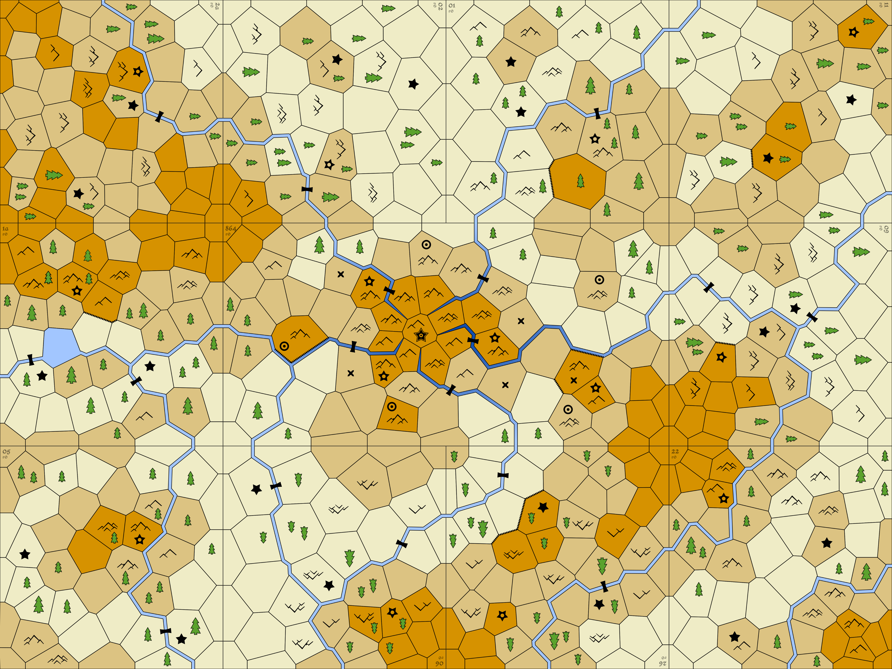

# Woven

A tabletop game of tactical magecraft.

## Components

Common:

* 1 map with terrain
* 33 double-sided Tapestry cards
* 36 Spell Fragment cards

Per-player/color:

* 1 Mage token
* 11 Mana counters
* 4 Starter spells

### Things on the Map

There are 3 elevations on the map:

* Lowlands - (light color)
* Midlands - (medium color)
* Highlands - (dark color)

In addition, each location can have the following terrain markers:

* Forest (single tree)
* Dense Forest (multiple trees)
* Rough terrain (mountain bumps)
* Rivers between locations

Some points of magical interest are marked:

* Ruin locations (stars with a circle). Ruins are also wellsprings
* Wellsprings (star)

In the center of the map there are special symbols:

* Citadel (big star)
* Sentry location (x)
* Watcher Targets (bullseye target circles)

## Object of Game

You are Mages competing for the right to claim the glory for destroying the ancient Citadel where
evil creatures have taken up residence.

Destroy the Citadel in the center of the map. Or, failing that, gather as many treasures as possible.

# How to Play

## Game Setup

### General

* Map in center of table
* Tapestry cards: Shuffle and place next to map
* Spell cards: Remove all starter spells, shuffle, place next to map

### For each player

* Choose a color
* Place Mage on map - on edge of one of the 2 tiles closest to you
* Take 4 starting spells
* Draw a random Tapestry card and choose a side to start your Tapestry

### To start game

* Choose starting player somehow

## Each turn

Choose one of the following Actions:

* Play a card to **Cast a Spell**
* Discard a card for its **Mundane Effect**
* **Re-cast** an Active Spell
* **Recover**

Free actions: At any time during your turn, you may

* Abandon an Eye or Charge and immediately add the token back in your Mana Pool.
* Change one of your Anchored Eyes into a normal Eye

When you've completed your Actions, if you are in a Special Location, then see Special Location section. 

### Cast a Spell

To cast a spell:

* Place the spell card from your hand into the Active Spell area
* Add Threads to your Tapestry to complete the spell pattern
    * To add a thread, take mana from your pool and place it on an empty Tapestry square
    * You must add at least 1 Thread to cast a spell

If you cannot complete with pattern, then you may not cast the spell.

If adding a Thread completes multiple spell patterns, then you must choose only 1.

After casting the spell once, you may cast this spell as many times as you wish
as long as you complete a new pattern in your tapestry for each cast.

### Mundane Effect

Place the card from your hand into your discard pile to use the Mundane Effect.
You may play multiple copies of the same Minor Effect on your turn to combine the effect.

There are 4 Mundane Effects:

* Draw Tapestry Card
* Create New Eye
* Move
* Pull a Thread

##### Draw Tapestry card

Draw a new Tapestry card and add it to your Tapestry

##### Create New Eye

Create a new Eye by taking Mana from your Pool and placing it on the map at your Mage's location.

If there is an Anchored Eye in this location, then it is un-Anchored.

##### Move 2 spaces

Move your Mage 2 spaces

##### Pull Thread

Pull a Thread to reclaim it from your Tapestry back into your Mana Pool.

This can also be used to un-anchor a Thread that is Anchored. (Although perhaps that should be "Picking a Thread")

### Re-cast an Active Spell

Any spell in the Active Spell area may be recast if you add mana
to your Tapestry to match the pattern.

### Recover

Recover is your rest and meditation action. It is comprised of multiple steps.

##### Acquisition

For each wellspring where you have an Eye:

* You may spend 1 to add an extra Mana (if available) to your pool
* Any remaining may be used to acquire spells:
    * Draw N cards (where N equals remaining wellsprings)
    * Choose 1
    * Optionally: Choose a spell from your hand to add to your Treasure
    * Return remaining spells to bottom of spell deck (for TTS add to deck and re-shuffle)
* If you did not acquire a spell, then Trash to top spell card

##### Reset Active Spells

* Move any non-Charged active spells to your discard

##### Draw Hand

* Draw hand back up to 4 cards

Note that you do not discard any remaining cards in your hand

# Special Locations

There are locations on the map that have special events that are triggered if you end your turn there.

## Ruin

If you end your turn on a Ruin, you automatically Explore the Ruin and gain an Artifact and a Treasure.

The Artifact card is placed at the bottom of your Discard pile (so no one else can see it).

The Treasure card is placed face down in your Treasure Pile.

After being explored, the Ruin collapses (remove the token from the map) and becomes a normal Wellspring location.

If you were targeted by a Watcher before entering the Ruin, it sees the Ruin collapse, assumes you are dead,
and goes back to its normal pattern target.

## Citadel

The Citadel cannot be explored and can only be attacked by magic spells. If you enter the Citadel location,
it acts like any normal location.

If you are being Targeted by a Watcher, then you cannot hide in the Citadel.

## Sentry

If you end your turn in a location with a Sentry, then they attack you. Good luck with that.

## Watcher

Watchers will only see you if you move, so if it flies over your location you're fine as long as you don't move.

# Magic

## Forms of Mana

Mana is how you perform your magic. Mana starts out in your Mana Pool, but it can be used in 3 forms.

### Threads

When mana placed on your tapestry to cast a spell, it becomes a Thread. This is how you cast spells.

Threads can be Anchored in your Tapestry (flipped to show the star side).
When a Thread is Anchored, it must first be un-Anchored (using Recover Thread) before it can be recovered back to your mana pool

### Eyes

When mana is placed on the map, it becomes an Eye. This is how you exert influence on the map.

Eyes can be Anchored on the map (flipped to show the star side).
When an Eye is Anchored, it may not be moved and other Eyes may not be moved into/through that location or any adjacent location.

Eyes can be un-Anchored by creating a new Eye in the same location.

### Charges

When mana is placed on a Spell, it becomes a Charge. This is how you gain extra abilities.

Spells and Artifacts that are Charged stay active in front of you.
When the last Charge is removed from a card, it is immediately returned to your discard.

## Spells

### Casting Spells

The act of casting a spell is a multi-step process.

First, you must create your Tapestry and ensure that it is arranged so that the spell
pattern can be created.

Then you must play the spell card and add Threads to the Tapestry to complete the pattern.

### Spell Patterns

The pattern shown on the spell card is the canonical form for the pattern, but when casting
you can create that pattern in any mirrored or rotated state.

### Active Spells

A spell is Active after you've cast it, but before you've cleaned up during Recover.

Spells that are Active can be cast again (without playing a card) if you can create the pattern in your Tapestry.

### Charges

Some spells accept a Charge when they are cast. This Charge can either maintain an ongoing effect
or it can be Spent for a one-time spell effect.

# Interacting with the World

When you explore 
## Mage Combat

When you attack a location, you attack everything in that location, and that includes any Mages or creatures
that happen to be there.

### Attack

When attacking, the total attack value is the sum of all attacks you make during a single turn.
If you don't defeat a monster in a single turn, then the damage is not counted.

### Curses

There is no in-game support for curses, however you should feel free to hurl curses at other players
when they perform actions you dislike.

# Citidel Defense

## Watchers

Watchers alway take the shortest path to their Target.
If multiple same-length paths to a Target, then they take the path that takes them furthest away from the Citadel.

Watchers detect if you move (on your turn) into a space within 3.
They will immediately change their target to you and the target will follow you until:

* You are more than 5 spaces away from one of the normal targets
* You enter a Ruin

Watchers are also sensitive to magic and will detect you if you have an Eye in their location.
You will be targeted if you are within 5 spaces of a Watcher Target.

### Attacking a Watcher

When attacking a Watcher, first calculate how much damage you're inflicting.
Then reveal the next Watcher card to determine its strength.

If you defeat a Watcher, it will crash to the ground in that location.
The Mage who defeated the Watcher takes the Watcher card and 1 Treasure cards and adds them to their Treasure pile.
The Watcher token stays on the map until its remains can be ransacked.
The player to ransacks the Watcher remains gains 2 Treasure.

## Sentries

Sentries detect if you move into adjacent space

When defeated, the player takes 1 Treasure card.

# Scoring

Calculate Artifact bonus for each player

Merge the following cards together:

* Treasure piles and player decks for all players
* Any spells remaining in the spell deck

Add all the stars on the cards

Score = Stars + Artifact bonus
