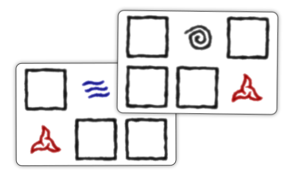
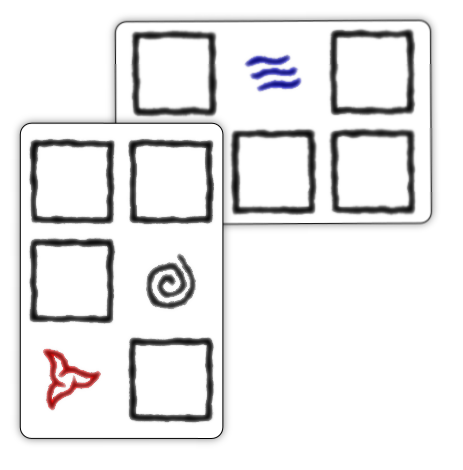
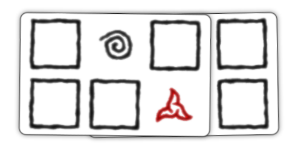
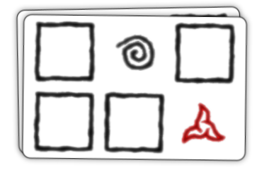

# Tapestry Card Placement

Each player has a Tapestry of cards in front of them
that allow them to cast spells. After the first
Tapestry card (which is simply placed in front of the
player), when Tapestry cards are placed they must overlap
part of a previously placed card in the Tapestry.

For example:

or rotated

Cards can overlap multiple spaces when placed:

Or they can even cover an entire card:

## Invalid Placement

The following placement is invalid because the placed
card does not overlap with a previously placed card.

Cards may not be tucked under previously placed cards.
