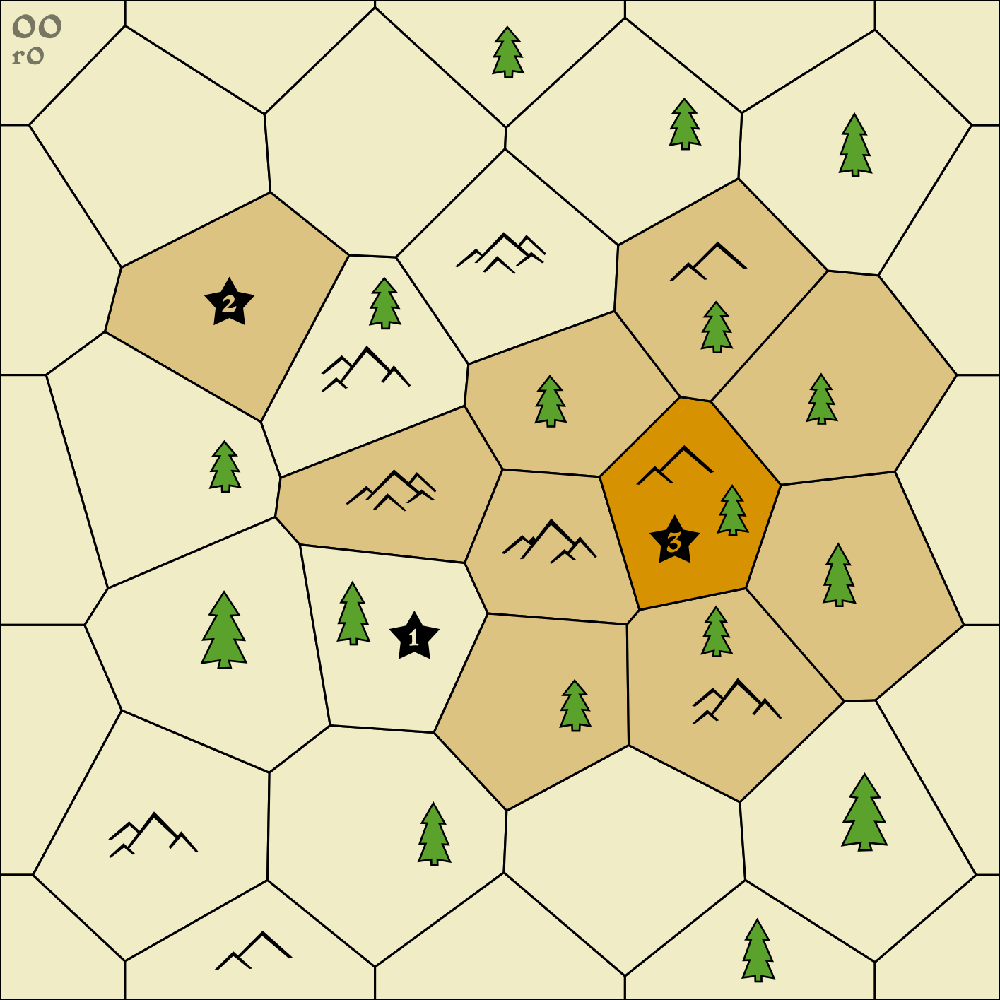
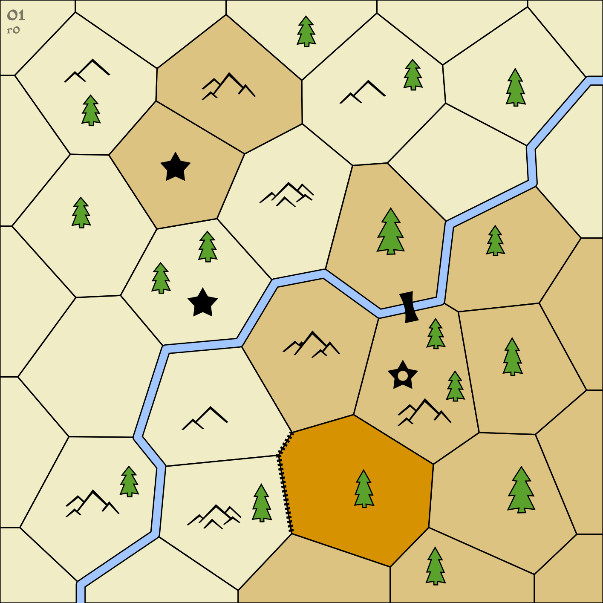
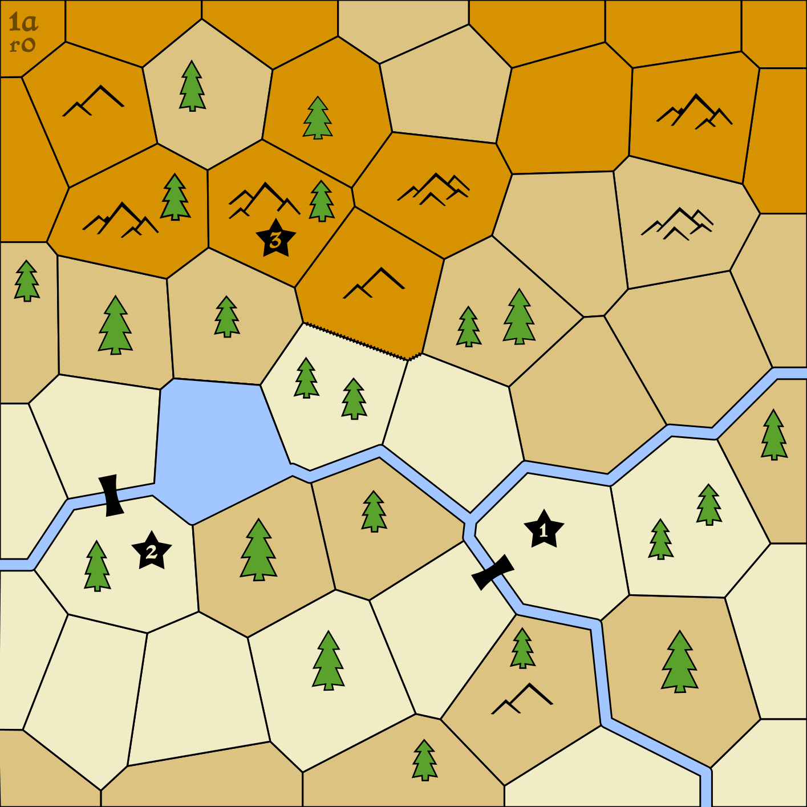
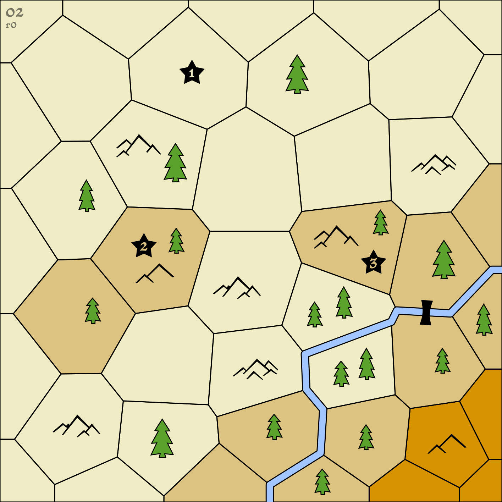
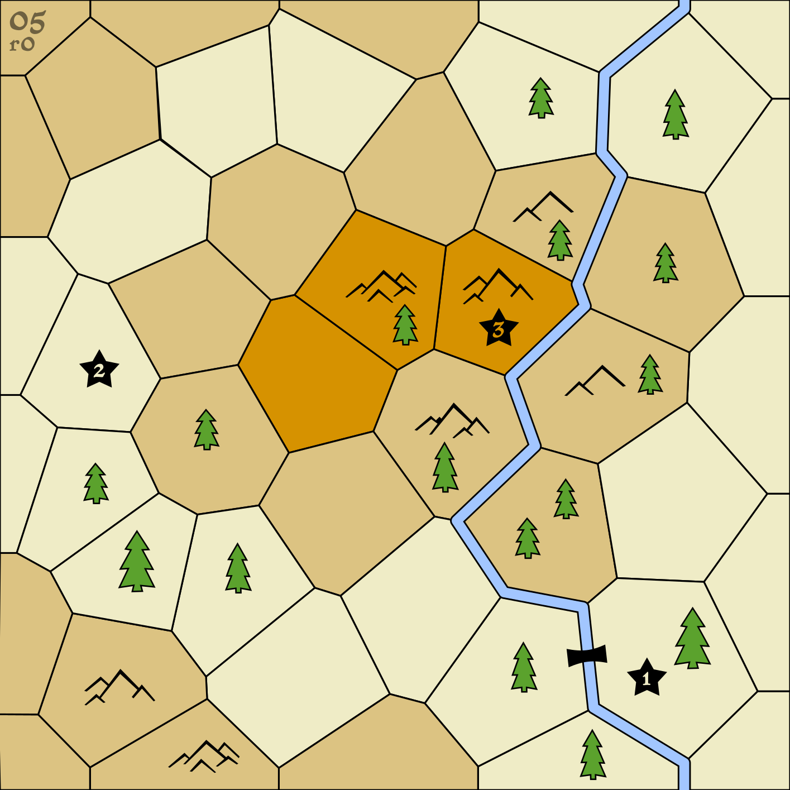
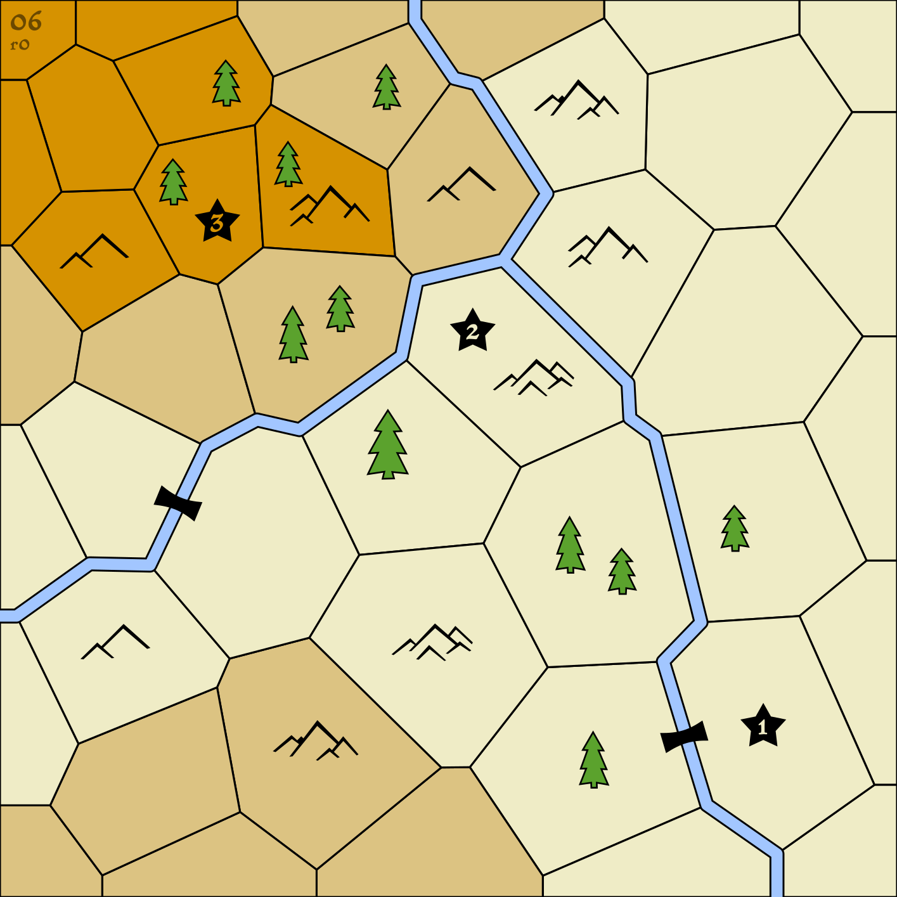
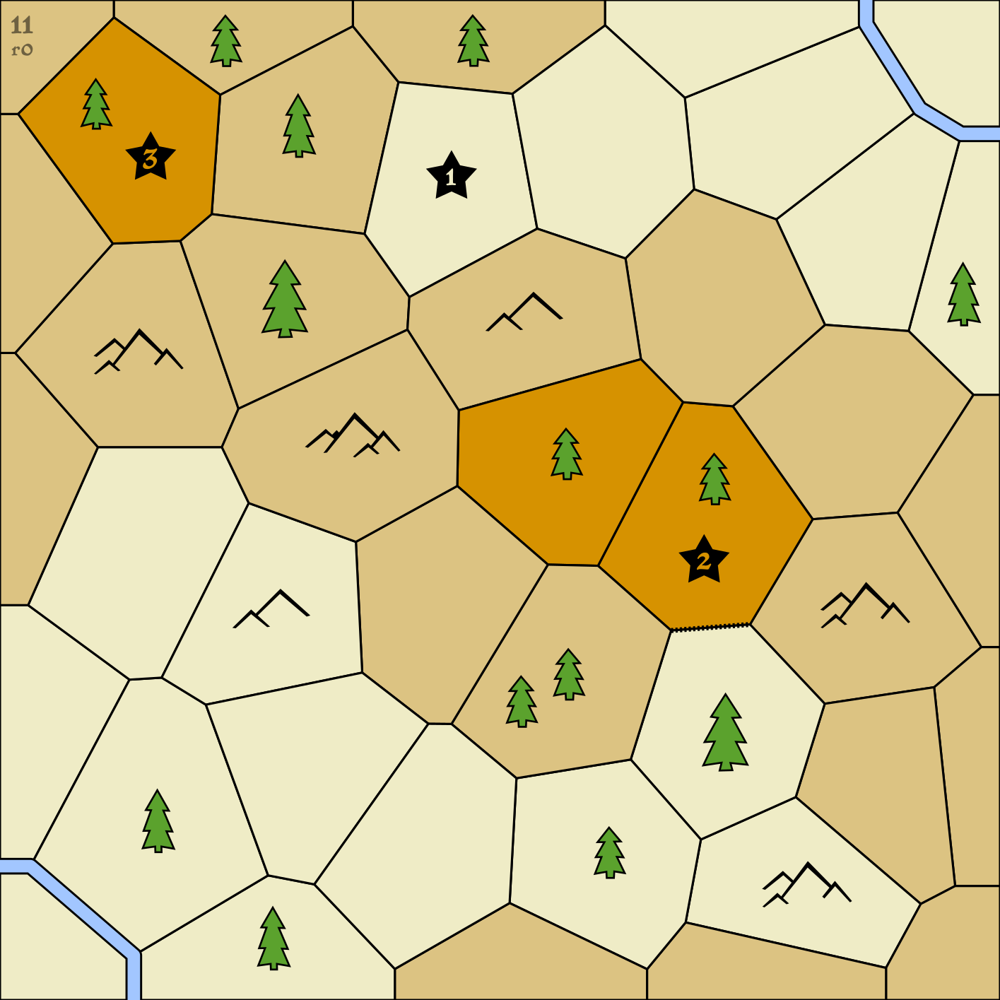
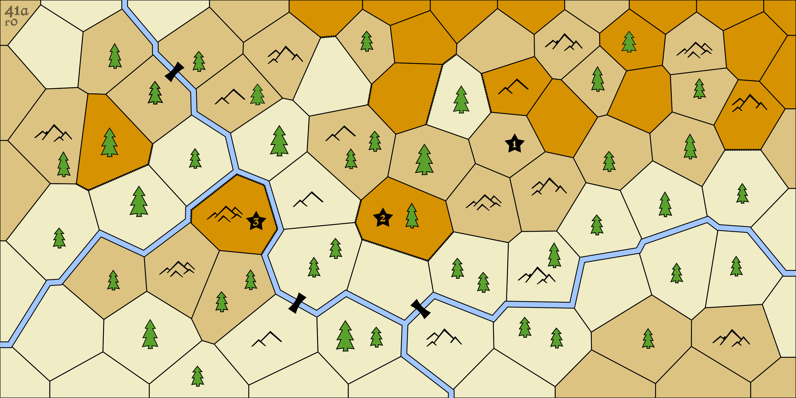
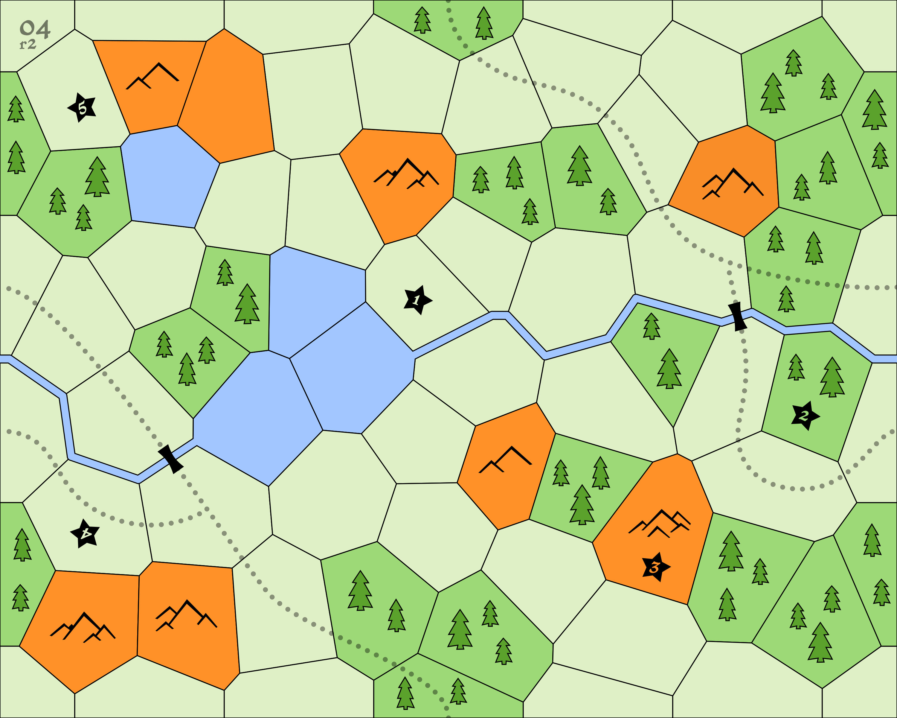
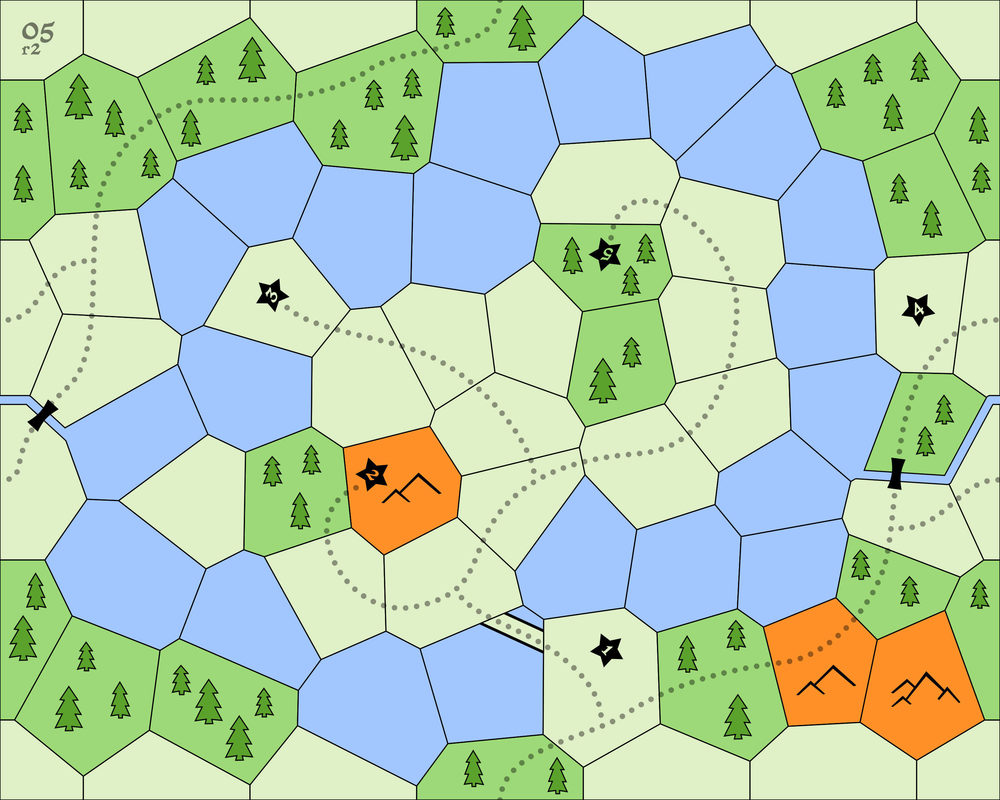

# Maps

The current prototype maps for Woven.

These maps are geomorphic voronoi tessellations with Plains, Forest, Mountain and Water regions.

* Geomorphic - you can rotate the maps and merge two along the edges
* Voronoi - map is partitioned into regions that are closest to a seed point (see [Wikipedia](https://en.wikipedia.org/wiki/Voronoi_diagram))

## Square Maps

## Wide Maps

## Older Maps

Older maps with Plains, Forest, Mountain and Water regions.

