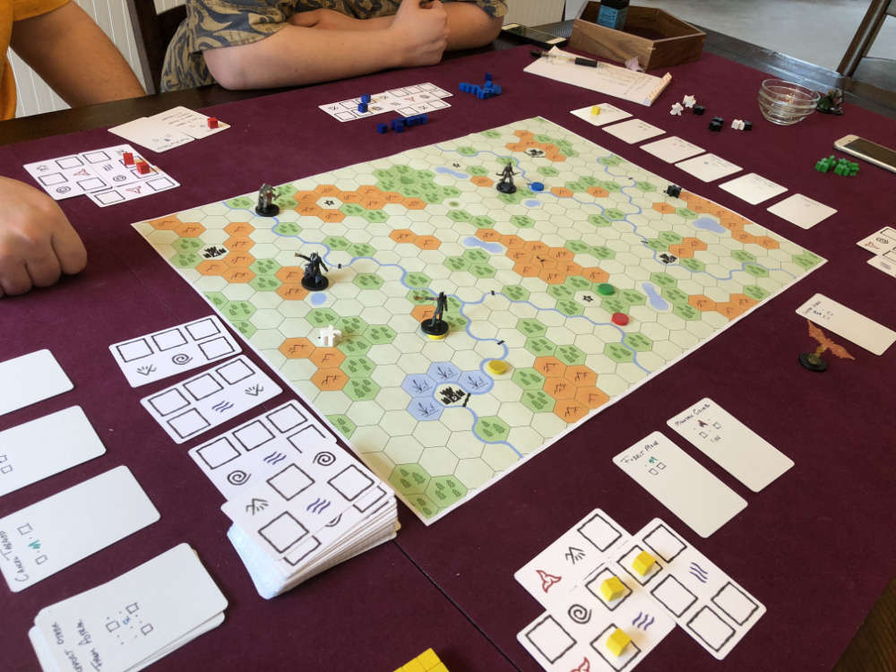

# Playtest #5

Tue 29 May 2018

Participants: self, AdamB, JeffB, GregN



## Components

* [22x19 hex board](../img/playtest_5_map.jpg)
* 66 (single-sided) matrix cards
* Token for each player
* 2 Tokens/player to mark target
* 10 Mana cubes

## Setup

* Deck of single-sided matrix cards with top 4 revealed
* All basic spell cards in shared area
* 2 rows (4 each) of simple and advanced spells

## Rules

Each turn, do each of the following:

* Remove a spell die from Matrix (if possible)
* Spend up to 3 Action Points (APs)

### Action Points

* 1 AP - move 2 spaces along road
* 1 AP - move 1 space into field
* 2 AP - move 1 space into forest
* 3 AP - move 1 space into mountain
* 2 AP - draw matrix card and add to matrix
* 1 AP - take 1 cubes and cast a spell
* 2 AP - take 2 cubes and cast spells
* 3 AP - take 6 cubes and cast spells

### Drawing and Adding to Matrix

Choose one of the available Matrix cards and add to
Matrix. And dice that are covered by the new card
are removed from the Matrix and added back into
your pool.

### Casting Spells

Take the specified number of dice from your pool and add them one at
a time to the Matrix.

After each die is placed, if that die completes a
spell fragment pattern, then that spell fragment
is cast and its effect happens immediately.

If multiple spell patterns are matched, the player
must choose one.

### Damage

Mages die when they take a single point of damage. They are sent to the Astral plane and must teleport back to the world. All targets, spell markers and charges are lost.

## Scenario

2 teams of 2 players "Capture the Flag"

## Shared Spells

Available to all players.

### Target
```
X
```
Element: None

Move a target one space in any direction.

### Teleport Self from Astral
```
X . .
. . X
```
Element: None

When in Astral plane, move self to a target.

### Haste
```
@ X
```
Element: Air

Gain 2 AP for normal movement

### Fire Burst
```
. X
@ .
```
Element: Fire

Attack all creature at target location for 1pt damage

### Protection
```
. X
@ .
```
Element: Earth

Defense: 1/2

Persistant: Place charge marker when cast

Two charges protect agains 1 pt attack.

### Teleport Self to Astral
```
. X
@ .
```
Element: Water

Move self into Astral Plane.

## Available Spells

### Cancel Targets
```
X . @ . X
```
Element: Earth

Removes all targets from target location (including this one).

### Levitate
```
X . .
. @ .
. . X
```
Element: Air

Place up to 2 charges in this spell.

Spend a charge to ignore terrain restrictions (and effects) when you move into (or are moved into) a location.

### Mountain Climber
```
. @ .
X . X
```
Element: Earth

For the rest of this turn, all movement through mountains costs 1 AP.

### Forest Move
```
. @
X X
```
Element: Earth

For the rest of this turn, all movement through forest costs 0 AP.

### Water Walk
```
@ .
X X
```
Element: Water

For the rest of this turn, if you are located in a hex adjacent to a river, you may move into any other hex adjacent to that river as long as you pay the standard movement cost.

### Obfuscate
```
X .
@ X
```
Element: Fire

Prevent new targeting in target and neighboring location.

### Split Target
```
X .
X X
```
Element: Neutral

Place a target 1 space away from one of your existing targets.

### Move Forest Target
```
X @
. X
```
Element: Earth

Move an existing target in a forest to any location in that connected forest.

### Move Mountain Target
```
X . @
. . X
```
Element: Fire

Move an existing target in a mountain to any location in that connected mountain.

### Move River Target
```
. @ .
X . X
```
Element: Water

Move an existing target in a river to any location in that connected river.

### Follow Target
```
. X .
@ . X
```
Element: Fire

If on an opponent's target space, place a target on the mage that controls that target.

## Advanced Spells

### Cancel Other Targets
```
X . @ . X
. . . . .
. . X . .
```
Element: Fire

Removes all targets from target location except the one used to cast this spell.

### Teleport Other to Astral Plane
```
. . . . X
. . @ . .
X . . . .
. . . X .
```
Element: Water

Move targeted creature to the Astral plane.

### Teleport Other from Astral Plane
```
X . . . .
. . @ . .
. . . . x
. X . . .
```
Element: Water

Move any creature in the Astral plane to a targeted location.

### Summon Air
```
X @ . X
. . X .
```

### Summon Earth
```
X @ . X
. . X .
```

### Summon Fire
```
X . @ X
. X . .
```

### Summon Water
```
X . @ X
. X . .
```

### Terraform
```
@ X X
. . X
```
Element: One for each


## Comments

Should there be a limit on the number of spells that mages can have at a time?

"Mountain Walk" - can't move into mountain with this spell, so you have to spend 3AP before you can use it. Would rather be able to tunnel through mountains.

Cannot move targets while in the astral plane
Summon Minions

* charges = number of spaces
* Air Minion can only move through Plains
* Others can move through element + Plains

For "Capture the Flag" game, you cannot move the flag through the astral plane.

Levitate until start of next turn. If over bad terrain, you must move off spot immediately.

Change Protection cost to be 1-1 (since you now have to spend one of the limited mana charges)

Use same token for target and mana

[A] Allow more than 2 targets at a time

Targets are like an army of minions that the mage sends forth.

[GN] Spell - Fire wall to block off an area

[A] Spell - Fire spell that hits multiple targets

Charges to block someone

Private prison - player locked in prison until they do sufficient damage to it.

Fireball to multiple spaces around target, but you lose the target

Lightning charge up and then fire them at multiple targets. Then remove target

[A] Obfuscate could be done without board markers by having charges. Spend them to move targets away when they get close to your targets

[A] Terraform Plainss - too weak

How to terraform Rivers

[A] Drafting cards at the start. For example:

* N piles of cards
	* Face down
	* Each initially with 1 card
* Takes turns choosing a pile
	* Look at cards on first pile, if you want it, take it
	* Otherwise, add a card to that pile and go to the next pile
* At some point, the "bad" piles will get better with the additional cards.

[GN] Wildcard element spot in spell to select the element of the spell. E.g,, the element for terraform

[A] Stand on location to get VP (like control). "King of the Mountain"

[J] Get free stuff at certain locations: spells, matrix cards, ...

Jeff:

* NEG - spell selection (discussed earlier)
* POS - like new spells that move target faster. Previously this was too slow.
* POS teleport with 2 parts

Greg:

* NEG - need another way for matrix cards to erase
	* Spend turn to remove all mana
	* Matrix cards are too expensive later. Perhaps the first 3 cost 2, then after that they cost 1
* NEG - didn't like target lagging behind on the board
	* Want to be able to control people more
	* Zoning map. want more player move
* POS - Matrix
* POS - Protection spells. Charging shield
* Would like to be able to play as other than a wizard (eg: a dragon)

Adam:

* NEG - element spells are too specific
	* Didn't have to commit in matrix to a particular element
	* Element in matrix should not be tied to earth elements
	* For multiple spells that are the same, use different patterns
* POS - Like idea of using same token for targets and mana

[A] Charges to make target location into a particular terrain type while the target remains there.

[A] Moving a target allows you to move all targets

Spells that can hit all targets simultaneously. Fireball.

Terraform - not enough in game cares about this.

Game is effectively mana worker placement

Changes to the map can be thought of as temporary enchantments

[GN] Make elements feel different. Air for move, ...

[A] Action points. Can they be removed? Spend mana tokens to draw card?

Haste could: move 3 plains, 2 forest, 1 mountain

Resting turns to instantly recover all cubes. Conflicts with using cubes in matrix as a recovery cost when casting spells.

* Possibly recover set number (3)

Have spells that are better if you have more targets.

No reason not to allow mirroring the spells patterns (less confusing).

## Suggestions/Actions

For next playtest:

* Try getting rid of Action Points
* Use only Mana tokens for Matrix, Charges and Targets
* Try using only 1 component (mana) for entire game
	* Use more charges on spells
* Don't try to link spell mana and terrain types.
* Allow spell patterns to be mirrored
