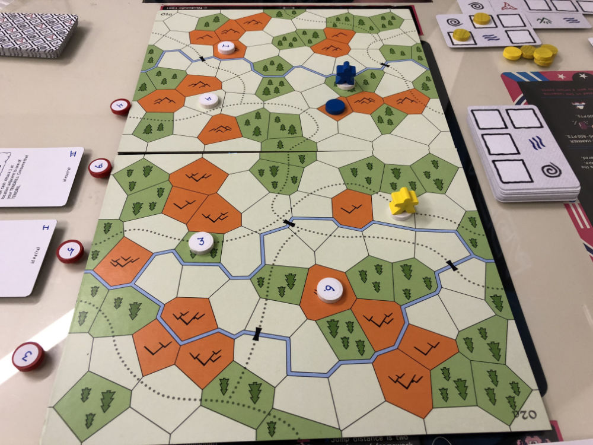

# Playtest #12

Fri 24 May 2019

Participants: self, AdamB

 

## Overview

* Testing:
	* Geomorphic voronoi tesselation map boards (1/player)
		* 3 marked spaces on map
	* 2 actions per turn
	* Player starts:
		* at random marked location
		* with only 1 mana
	* Gain more mana as you cast spells
	* Removing "spent mana pool". Mana is either available for use or it is being used somewhere
		* So you don't spend mana as currency

## Components

* 2 geomorphic map boards
* 33 (double-sided) matrix cards
* 36 Spell Cards (rev4)
* Token for each player
* 13 Mana disks

## Setup

* Deck of double-sided tapestry cards with top card revealed
* Deck of spells sorted by spell "level"
* Set of 4 spells revealed.

## Rules

Each turn do 2 actions (can repeat):

* Cast spell (using as much mana as needed to complete a single spell)
* Move on map (3 movement points: Plains=1, Forest=2, Mountain=3)
* Rest to recover 1 mana from Tapestry
* Take and meld Tapestry card

If you cast a spell in front of an Admission Counselor, they you acquire that spell.

## Scenario

You've been invited to test for admission to some Wizard Academy. You need to prove that you would be a worthwhile student to admit.

You must approach the Elemental Admission Counselors and cast spells. Once you do so you gain the spell into your repetoire (and gain VPs as well).

## Comments

* Takes entire move to move into a mountain space.
	* Normally not a problem, but can be frustrating when that is where the counselor is located (early game)
* Need more than 3 marked spaces per map.

Adam:

* Liked the cold war feel when the tendrils were being placed on the map - attacks were threatened
* Suggest: Don't move the counselor until the end of the turn. That way you can plan a turn where you acquire 2 spells.
* Suggest: Gain 1 mana for each new spell, regardless of the spell. Simpler.
* If you start with 2 mana, then you can cast all the spells in the deck. Then they don't need to be sorted by "level".
* Multiple copies of each spell?
	* But can you acquire multiple copies, or is that not allowed.
	* If allowed, a player could hoard spells
	* If not allowed, a player could be blocked from acquiring spells (if they already had all available spells)
* Suggest: Regain mana when you move (non-magically). Absorb mana from the world. Feels better than wasting a action to "rest".

What about having different mana types?

* When you walk in a forest, you gain "forest mana"
* Some places on the spell cards could require a certain type of mana.

All marked spaces should be accessible via road.

## Suggestions/Actions

For next playtest:

* Add more marked spots on each map board: 5
* What happens when a player is killed? VPs?
	* Black markers that count as -1 VP.
	* Lost all active tendrils
	* Possibly lose one card from Tapestry
* "Haste" spell feels better if it gives move bonus to move along roads. Or gives bonus movement points.

From previous playtest:

* Add more spells that attack tendrils
